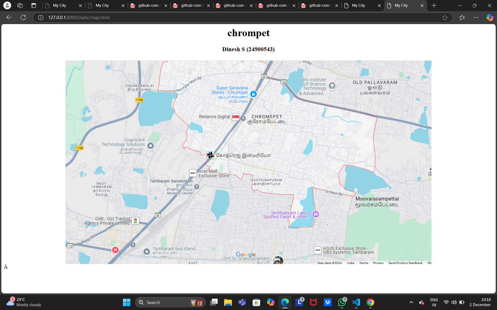
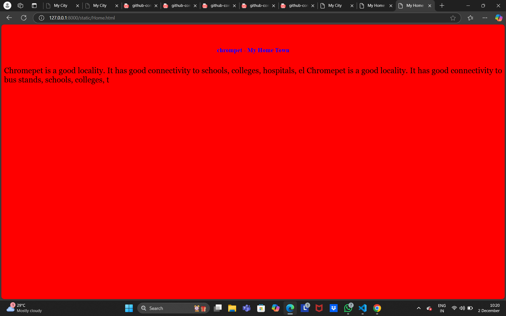
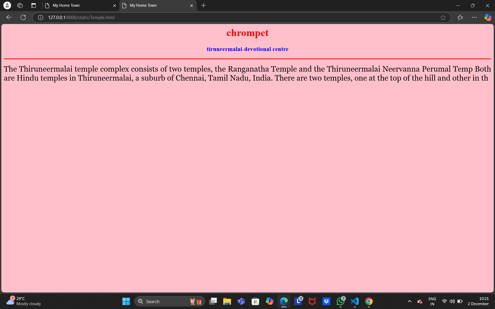
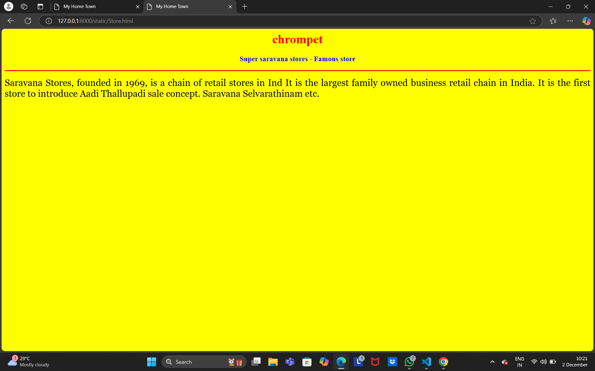
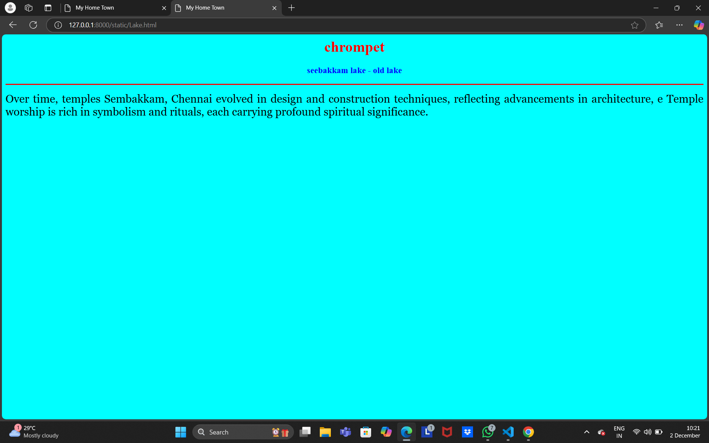
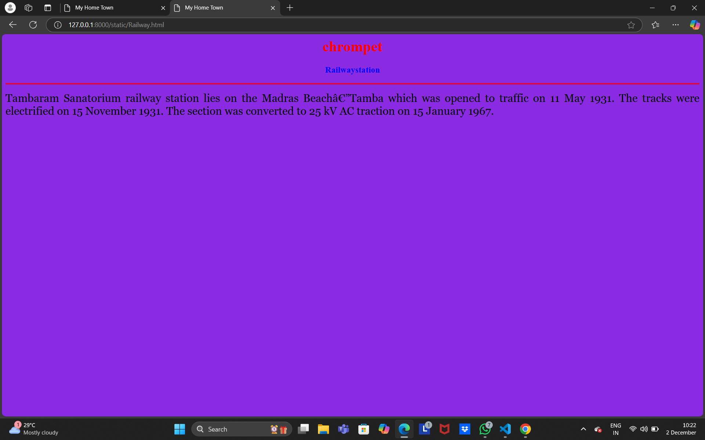

# Ex04 Places Around Me
## Date: 01.12.2024

## AIM
To develop a website to display details about the places around my house.

## DESIGN STEPS

### STEP 1
Create a Django admin interface.

### STEP 2
Download your city map from Google.

### STEP 3
Using ```<map>``` tag name the map.

### STEP 4
Create clickable regions in the image using ```<area>``` tag.

### STEP 5
Write HTML programs for all the regions identified.

### STEP 6
Execute the programs and publish them.

## CODE
```
map.html

<html>
    <head>
        <title>My City</title>
    </head>
    <body>
        <h1 align="center">
            <font colour="red"><b>chrompet</b></font>
        </h1>
        <h3 align="center">
            <font colour="blue"><b>Dinesh S (24900543)</b></font>
        </h3>
        <center>
         <!-- Image Map Generated by http://www.image-map.net/ -->


<map name="image-map">
    <area target="" alt="saravanastore" title="saravanastore" href="Store.html" coords="434,69,602,148" shape="rect">
    <area target="" alt="Sembakkam Lake" title="Sembakkam Lake" href="Lake.html" coords="752,477,80" shape="circle">
    <area target="" alt="Railway station" title="Railway station" href="Railway.html" coords="259,370,407,423" shape="rect">
    <area target="" alt="Temple" title="Temple" href="Temple.html" coords="174,70,279,108" shape="rect">
    <area target="" alt="Home" title="Home" href="Home.html" coords="566,172,555,269,634,252,715,186,637,128,567,172" shape="poly">
</map>
        </center>
    </body>
</html>

home.html

<html>
    <head>
        <title>My Home Town</title>
    </head>
    <body style="background-color: red;">
        <h1 align="center">
            <font color="red"><b>chrompet</b></font>
        </h1>
        <h3 align="center">
            <font color="blue"><b>chrompet - My Home Town</b></font>
        </h3>
        <hr size="3" color="red">
        <p align="justify">
            <font face="georgia" size="5">
                Chromepet is a good locality.
                It has good connectivity to schools, colleges, hospitals, el
                Chromepet is a good locality.
                It has good connectivity to bus stands, schools, colleges, t
            </font>
        </p>
    </body>
 </html>

 store.html

 <html>
    <head>
        <title>My Home Town</title>
    </head>
 <body style="background-color: yellow;">
 <h1 align="center">
<font color="red"><b>chrompet</b></font>
 </h1>
 <h3 align="center">
 <font color="blue"><b>Super saravana stores - Famous store</b></font>
 </h3>
 <hr size="3" color="red">
 <p align="justify">
 <font face="georgia" size="5">
 Saravana Stores, founded in 1969, is a chain of retail stores in Ind
 It is the largest family owned business retail chain in India.
 It is the first store to introduce Aadi Thallupadi sale concept.
 Saravana Selvarathinam etc.
 </p>
 </body>
 </html>

 temple.html

  <html>
 <head>
 <title>My Home Town</title>
 </head>
 <body style="background-color: pink;">
 <h1 align="center">
 <font color="red"><b>chrompet</b></font>
 </h1>
 <h3 align="center">
 <font color="blue"><b>tiruneermalai-devotional centre</b></font>
 </h3>
 <hr size="3" color="red">
 <p align="justify">
 <font face="georgia" size="5">
 The Thiruneermalai temple complex consists of two temples,
 the Ranganatha Temple and the Thiruneermalai Neervanna Perumal Temp
 Both are Hindu temples in Thiruneermalai, 
a suburb of Chennai, Tamil Nadu, India.
 There are two temples, one at the top of the hill and other in th
 </p>
 </body>
 </html>

 lake.html

  <html>
 <head>
 <title>My Home Town</title>
 </head>
 <body style="background-color: aqua;">
 <h1 align="center">
 <font color="red"><b>chrompet</b></font>
 </h1>
 <h3 align="center">
 <font color="blue"><b>seebakkam lake - old lake</b></font>
</h3>
 <hr size="3" color="red">
 <p align="justify">
 <font face="georgia" size="5">
 Over time, temples Sembakkam, Chennai evolved in design and
 construction techniques, reflecting advancements in architecture, e
 Temple worship is rich in symbolism and rituals,
 each carrying profound spiritual significance.
 </p>
 </body>
 </html>

 railway.html

  <html>
 <head>
 <title>My Home Town</title>
 </head>
 <body style="background-color: blueviolet;">
 <h1 align="center">
 <font color="red"><b>chrompet</b></font>
 </h1>
 <h3 align="center">
 <font color="blue"><b>Railwaystation</b></font>
 </h3>
 <hr size="3" color="red">
 <p align="justify">
 <font face="georgia" size="5">
 Tambaram Sanatorium railway station lies on the Madras Beach—Tamba
 which was opened to traffic on 11 May 1931.
 The tracks were electrified on 15 November 1931.
 The section was converted to 25 kV AC traction on 15 January 1967.
 </p>
 </body>
 </html>
```

## OUTPUT







## RESULT
The program for implementing image maps using HTML is executed successfully.
